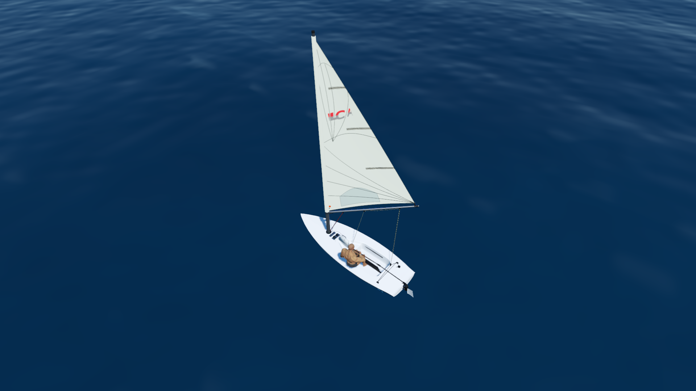
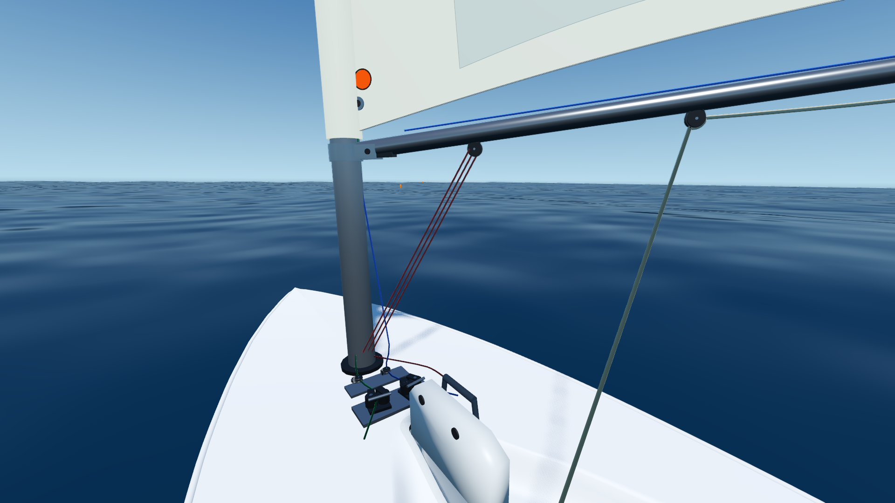
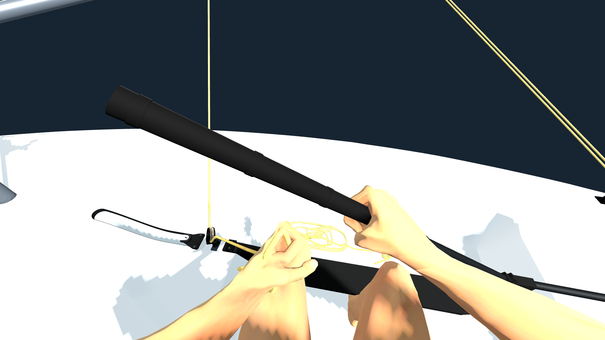

<h1 align="center">Windward</h1>

  <strong>바람을 읽고, 배를 느끼다.</strong> 
  ILCA 7을 바탕으로 만들어가는 1인칭 딩기 세일링 게임

  <a href="#제작-목적">제작 목적</a> ·
  <a href="#게임-설명">게임 설명</a> ·
  <a href="#게임-조작법">게임 조작법</a>

개발 중인 프로토타입입니다. 대표 이미지는 콘셉트 아트이며 실제 플레이 화면과 다릅니다.

---

## 제작 목적

Windward는 **바람과 세일, 그리고 사람의 움직임이 하나로 이어지는 항해 경험**을 만드는 프로젝트입니다.

러더로 방향을 바꾸고, 시트를 당기거나 풀고, 몸을 움직여 배의 균형을 잡는 일. 각각의 조작이 배의 움직임과 어떻게 연결되는지 직접 느낄 수 있는 게임을 지향합니다. 세일링을 처음 접하는 사람에게는 조작을 이해하는 계기를, 경험이 있는 사람에게는 익숙한 감각을 다시 살펴볼 공간을 만들고자 합니다.

빠른 기록이나 경기 규칙보다 **배 한 척을 다루는 기본적인 즐거움**을 먼저 완성합니다. 자유 항해를 충분히 다듬은 뒤, 같은 기반 위에 훈련과 레이싱 경험을 넓혀갈 계획입니다.

## 게임 설명

작은 딩기 한 척, 한 명의 세일러, 그리고 바다. Windward는 세일러의 눈높이에서 ILCA 7을 직접 조종하는 1인칭 세일링 게임을 지향합니다. 바람의 방향에 맞춰 진로와 세일을 조절하고, 배의 반응을 느끼며 항해하는 경험을 목표로 합니다.

현재는 **조작 검수 모드**와 **항해 프로토타입**을 분리해 개발하고 있습니다. 검수 모드에서는 시트와 러더를 조작해 볼 수 있고, 항해 프로토타입에서는 바다 위의 배를 조종해 볼 수 있습니다. 두 모드의 실행 방법과 지원 범위는 아래 조작법에 안내되어 있습니다.

최신 조작 개선은 검수 모드를 중심으로 진행하며, 안정화한 기능부터 항해 프로토타입에 단계적으로 반영할 예정입니다. 선체 등 일부 요소는 공유하지만, 현재 두 모드의 장비 구성과 손동작·조작 방식에는 차이가 있습니다. 우현·하이크 중 시트 조작, 태킹·자이빙, 세일 공력도 개선·확장 중입니다.

### 개발 중 화면

항해 프로토타입 · 선체와 세일을 함께 바라보는 외부 촬영 시점

| 항해 프로토타입 · 1인칭 | 조작 검수 모드 · 1인칭 |
| :---: | :---: |
|  |  |

2026.09.12 촬영 · 안내 UI를 숨긴 실제 실행 화면입니다. 조작 검수 모드는 바다·세일을 제외한 별도 개발 장면입니다.

현재 화면은 최종 그래픽이 아닙니다. 수면과 조명, 배와 캐릭터의 시각적 품질도 단계적으로 개선할 계획입니다.

스크린샷과 아래 조작 안내는 개발 중인 작업본 기준이며, 공개 저장소의 코드와 차이가 있을 수 있습니다.

## 게임 조작법

### 조작 검수 모드 · 최신 개발 장면

Godot **4.7.1**에서 `project.godot`을 연 뒤, [`src/preview/rudder_motion_lab.tscn`](src/preview/rudder_motion_lab.tscn)을 선택하고 편집기에서 **F6**으로 실행합니다. 기본 상태는 **좌현 · 앉은 자세 · 메인시트**입니다.

| 입력 | 동작 |
| :--- | :--- |
| 마우스 휠 ↓ / ↑ | 메인시트 당기기 / 풀기 |
| `A` / `D` | 러더 조작 — 시트 조작과 함께 사용 가능 |
| `S` | 러더 중립 |
| `F4` / `F1` | 1인칭 / 외부 시점 |
| 화면 클릭 → 마우스 이동 | 시선 조작 |
| `Esc` | 커서 해제 |
| `R` | 시트 길이 초기화 |
| `H` | 안내 패널 표시 / 숨기기 |
| 화면의 **Reset setup** | 기본 검수 상태로 복귀 |

휠을 돌리는 양으로 시트 조절량을 조정합니다. 커서가 풀려 있을 때는 슬라이더나 선택 메뉴 밖에서 휠을 사용하세요.

추가 검수 조작과 현재 지원 범위

| 입력 | 동작 / 제한 |
| :--- | :--- |
| `1` | 메인시트 선택 |
| `2` / `3` / `4` | 붐뱅 / 커닝험 / 아웃홀 선택 — 실제 조작은 아직 미구현 |
| `Z` / `X` | 하이크 자세 줄이기 / 늘리기 — 하이크 중 시트 입력은 차단 |
| `8` | 좌우 검수 자세 전환 — 실제 태킹·자이빙 동작은 아님 |
| `F2` / `F3` | 정면 / 탑뷰 |
| `F5` / `F6` / `F7` | 시트 손 / 익스텐션 손 / 상완 근접 시점 |

위 기능키는 **실행 중인 게임 창에 포커스가 있을 때**의 시점 조작입니다. 편집기의 F5·F6 실행 단축키와 구분하세요. 우현 또는 하이크 자세에서는 시트 조작을 지원하지 않으므로, 메인시트 검수로 돌아오려면 **Reset setup**을 사용하세요.

항해 프로토타입 · 편집기 F5 실행

기본 실행 장면은 [`src/main/main.tscn`](src/main/main.tscn)입니다. 위 검수 모드와 조작 체계가 다르며, 최신 손동작과 항해 동역학의 통합은 진행 중입니다.

| 입력 | 동작 |
| :--- | :--- |
| `A` / `D` | 러더 조작 |
| `W` / `S` | 메인시트 당기기 / 풀기 |
| `C` | 탑다운 / 1인칭 전환 |
| 마우스 휠 | 탑다운 확대 / 축소 |
| 마우스 오른쪽 버튼 드래그 | 탑다운 시점 회전 |
| 마우스 이동 | 1인칭 시선 조작 |
| `Esc` / 왼쪽 클릭 | 1인칭 커서 해제 / 다시 고정 |

태킹·자이빙과 자세 전환에 알려진 문제가 남아 있는 개발용 프로토타입입니다.

